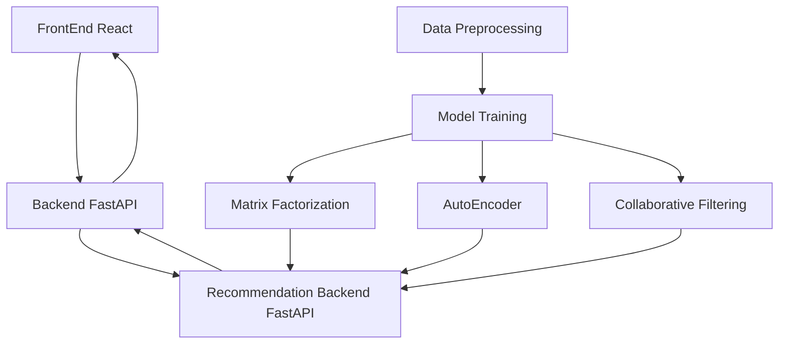

# RecoMan
This project is a hands-on project focused on building and experimenting with recommendation systems for movie recommendation.

# Architecture



# How to run

```shell
git clone https://github.com/JeiKeiLim/RecoMan.git
cd RecoMan

# Install dependencies
conda install -f environment.yml

# Activate the environment
conda activate RecoMan

# Run the recommender system engine
cd recommendation_systems
python recommendation_systems_main.py

# Run the backend
cd backend
python backend_main.py

# Run the frontend
cd frontend
npm install
npm start
```


# Features
## Continuous Integration (CI)
  - Formating
  - Linting
  - Unit testing
  - API document generation
  - GitHub action

## Docker support
```shell
git clone https://github.com/j-marple-dev/python_template.git
cd python_template
./run_docker.sh build
# You can add build options
# ./run_docker.sh build --no-cache

./run_docker.sh run
# You can add running options
# ./run_docker.sh run -v $DATA_PATH:/home/user/data

# Re-run last docker container
./run_docker.sh exec
```

# Setting environment
```shell
git clone https://github.com/j-marple-dev/python_template.git
cd python_template
./run_check.sh init_conda
./run_check.sh init_precommit  # Developer only
```

# Developers
* Please refer to [CODE_OF_CONDUCT](CODE_OF_CONDUCT.md) guide.
