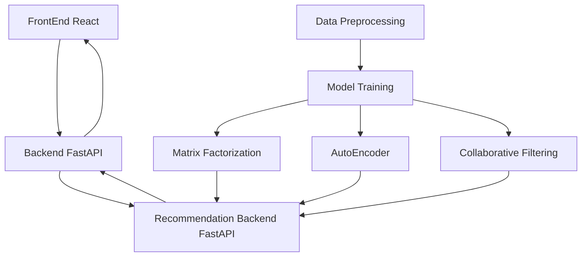

# RecoMo
This project is a hands-on project focused on building and experimenting with recommendation systems for movie recommendation. 

The project covers the following topics:

1. Building a recommendation system engine using FastAPI.
    - Recommendation algorithm implementations
        - Collaborative Filtering
        - Matrix Factorization
        - AutoEncoder
    - Training the models
    - Serving the models using FastAPI.
2. Building a backend using FastAPI.
3. Building a frontend using React.


# Architecture



## Frontend
- The frontend is built using React in [frontend](frontend) directory.

## Backend
- The backend is built using FastAPI in [backend](backend) directory.

## Recommender System Engine API
- The recommendation system engine is built using FastAPI in [recommendation_systems](recommendation_systems) directory.


# How to run
## Prerequisites
- This projects uses MovieLens20M dataset. You can download the dataset from [here](https://grouplens.org/datasets/movielens/20m/).

## Anaconda environment setup

```shell
git clone https://github.com/JeiKeiLim/RecoMo.git
cd RecoMo

# Install dependencies
conda env create -f environment.yml

# Activate the environment
conda activate RecoMo
```

## Getting movie posters
### The Movie Database (TMDb) API
- The project uses The Movie Database (TMDb) API to get the movie posters. You need to get the API key from [here](https://www.themoviedb.org/documentation/api).

### Downloading movie posters
- Please refer to [backend/data_prepare/README.md](backend/data_prepare/README.md) for downloading movie posters.


## Running the project
### Recommender system engine API
```shell
# Run the recommender system engine
conda activate RecoMo
cd recommendation_systems
python recommendation_systems_main.py
```

### Backend
```shell
# Run the backend
conda activate RecoMo
cd backend
python backend_main.py
```

### Frontend
```shell
# Run the frontend
cd frontend
npm install
npm start
```


# Training the model
```shell
# Run the model training script

cd recommendation_systems

# For Collaborative Filtering
PYTHONPATH=. models/collaborative_filtering.py

# For Matrix Factorization
PYTHONPATH=. trainer/train_pytorch_matrix_factorization.py

# For AutoEncoder
PYTHONPATH=. trainer/train_pytorch_autoencoder.py
```

# Configurations
- RecoMo uses [hydra](https://hydra.cc) for configuration management.
- The configurations can be found in the [res/configs](res/configs) directory.

## Choosing the model
The model can be chosen in the [res/configs/base_config.yaml](res/configs/base_config.yaml) file. The `recommender_systems.model` key can be set to following:

- collaborative_filter
- matrix_factorization
- autoencoder

## Model specific configurations
- Please refer to the yaml files under [res/configs/models](res/configs/models) for the model specific configurations.


# Features
## Continuous Integration (CI)
  - Formating
  - Linting
  - Unit testing
  - API document generation
  - GitHub action

## Docker support
```shell
git clone https://github.com/j-marple-dev/python_template.git
cd python_template
./run_docker.sh build
# You can add build options
# ./run_docker.sh build --no-cache

./run_docker.sh run
# You can add running options
# ./run_docker.sh run -v $DATA_PATH:/home/user/data

# Re-run last docker container
./run_docker.sh exec
```

# Setting environment
```shell
git clone https://github.com/j-marple-dev/python_template.git
cd python_template
./run_check.sh init_conda
./run_check.sh init_precommit  # Developer only
```

# Developers
* Please refer to [CODE_OF_CONDUCT](CODE_OF_CONDUCT.md) guide.

# Appendix
## References
- [MovieLens 20M Dataset](https://grouplens.org/datasets/movielens/20m/)
- [The Movie Database (TMDb) API](https://www.themoviedb.org/documentation/api)
- Jonathan L. Herlocker, Joseph A. Konstan, Al Borchers, and John Riedl. 1999. [An algorithmic framework for performing collaborative filtering](https://dl.acm.org/doi/10.1145/312624.312682).
- Badrul Sarwar, George Karypis, Joseph Konstan, and John Riedl. 2001. [Item-based collaborative filtering recommendation algorithms](https://dl.acm.org/doi/10.1145/371920.372071).
- Ruslan Salakhutdinov and Andriy Mnih. 2007. [Probabilistic matrix factorization](https://papers.nips.cc/paper/3208-probabilistic-matrix-factorization.pdf).
- Suvash Sedhain, Aditya Krishna Menon, Scott Sanner, and Lexing Xie. 2015. [AutoRec: Autoencoders Meet Collaborative Filtering](https://dl.acm.org/doi/10.1145/2740908.2742726).

